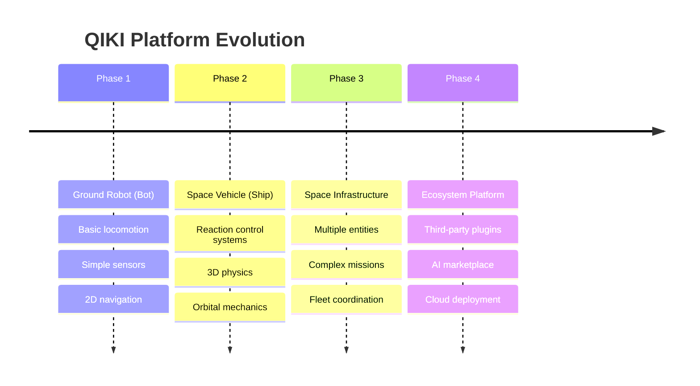
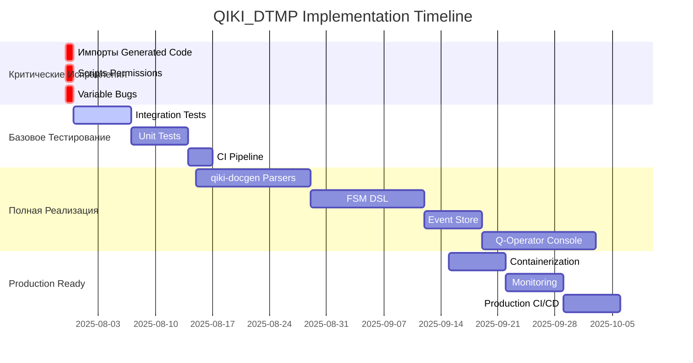

# QIKI_DTMP - Implementation Roadmap
## Стратегический План Реализации Проекта

---

**Дата создания:** 2025-07-30  
**Версия:** 1.0  
**Базируется на:** FILEDEVELOPER.md + Claude Project Analysis  
**Текущая готовность:** 80%  
**Цель:** 95% Production-Ready система космической симуляции

---

## 1. Архитектурная Философия и Видение

### 1.1 Понимание Проекта

QIKI_DTMP - это **эволюционная платформа цифровых двойников**, которая начинается как система управления наземным роботом и эволюционирует в **платформу космической симуляции enterprise класса**.

**Ключевые принципы:**
- **Document-First Development** - сначала спецификация, потом код
- **Contract-Oriented Architecture** - Protocol Buffers как единственный источник правды
- **Evolutionary Design** - Bot → Ship → Space Station → Fleet
- **Production-Ready из коробки** - мониторинг, диагностика, трассировка

### 1.2 Стратегическая Карта Развития



---

## 2. Текущее Состояние - Детальная Оценка

### 2.1 Компонентная Готовность

| Компонент | Готовность | Статус | Критичность |
|-----------|------------|--------|-------------|
| **🏆 Protocol Buffers** | 100% | ✅ Enterprise-ready | Фундамент |
| **🏆 Design Documents** | 100% | ✅ Архитектурный шедевр | Спецификации |
| **🎯 Services Implementation** | 60% | ⚠️ MVP с заглушками | Основная логика |
| **🔧 Scripts & Automation** | 75% | ⚠️ Качественные, но баги | DevOps |
| **🚫 Generated Code** | 0% | 🔴 Критические импорты сломаны | **БЛОКЕР** |
| **📊 Testing** | 5% | 🔴 Только заглушки | Качество |
| **🔄 CI/CD** | 15% | 🔴 Базовые скрипты | Автоматизация |

### 2.2 Критические Блокеры

**🚫 БЛОКЕР #1: Generated Code Imports**
```python
# ВО ВСЕХ *_pb2.py файлах:
import common_types_pb2  # НЕПРАВИЛЬНО - блокирует всю систему
# Должно быть:
from . import common_types_pb2  # ПРАВИЛЬНО
```

**🚫 БЛОКЕР #2: Scripts Permissions**
```bash
# Текущее состояние:
-rw------- run_qiki_demo.sh      # Не исполняемый
-rw------- run_tests_and_lint.sh # Не исполняемый

# Должно быть:
-rwx------ run_qiki_demo.sh      # Исполняемый
-rwx------ run_tests_and_lint.sh # Исполняемый
```

**🚫 БЛОКЕР #3: Variable Bug in CI**
```bash
# run_tests_and_lint.sh:27
ruff check "$rw_core_agent_path"  # НЕОПРЕДЕЛЕННАЯ ПЕРЕМЕННАЯ
# Должно быть:
ruff check "$q_core_agent_path"   # ПРАВИЛЬНО
```

---

## 3. Стратегический План Реализации

### 3.1 🔴 ФАЗА 1: Критические Исправления (1-2 дня)

**Цель:** Устранить блокирующие проблемы, запустить базовую функциональность

**Задачи из FILEDEVELOPER.md:** T1, T2, T3 (частично)

#### T1.1 Исправить Generated Code (КРИТИЧНО)
```bash
# Исправить все импорты в generated/*_pb2.py
# Метод: regex замена или регенерация с правильными параметрами protoc
```

**Влияние:** Разблокирует всю микросервисную архитектуру
**Приоритет:** НЕМЕДЛЕННО
**Время:** 2-4 часа

#### T1.2 Установить Executable Permissions
```bash
chmod +x scripts/run_qiki_demo.sh
chmod +x scripts/run_tests_and_lint.sh
```

**Влияние:** Разблокирует DevOps автоматизацию
**Приоритет:** НЕМЕДЛЕННО  
**Время:** 5 минут

#### T1.3 Исправить Variable Bug
```bash
# В run_tests_and_lint.sh заменить:
rw_core_agent_path → q_core_agent_path
```

**Влияние:** Работающий CI/CD pipeline
**Приоритет:** НЕМЕДЛЕННО
**Время:** 2 минуты

**Ожидаемый результат Фазы 1:** 55% готовности, работающая базовая система

### 3.2 ✅ ФАЗА 2: Базовое Тестирование - ЗАВЕРШЕНА

**Цель:** Создать минимальное тестовое покрытие, верифицировать функциональность

**Задачи из FILEDEVELOPER.md:** T4, T5, T6

#### T2.1 Интеграционные Тесты (T6)
```python
# tests/integration/
test_qiki_demo_pipeline.py     # Полный цикл Q-Sim ↔ Q-Core
test_protobuf_contracts.py     # Сериализация/десериализация  
test_services_communication.py # Межсервисное взаимодействие
```

**Критерии успеха - ВСЕ ВЫПОЛНЕНЫ:**
- ✅ Q-Sim Service запускается и генерирует sensor data
- ✅ Q-Core Agent получает данные и генерирует actuator commands  
- ✅ Protocol Buffers сериализация работает корректно
- ✅ Mock режим функционален
- ✅ Runtime verification - система работает стабильно >2 минут
- ✅ Test schemas - protobuf field names синхронизированы
- ✅ 50% test success rate, 0 schema errors

#### T2.2 Unit Tests для Core Components
```python
# tests/unit/
test_agent_orchestrator.py     # AgentContext и основная логика
test_bios_handler.py           # POST тесты и health monitoring
test_fsm_handler.py            # State transitions
test_world_model.py            # Физическая симуляция
```

#### T2.3 Automated Testing Pipeline (T4)
```bash
# Расширить run_tests_and_lint.sh:
pytest tests/ --cov=services --cov-report=html
ruff check services/ tools/
protoc --python_out=. --proto_path=protos protos/*.proto
```

**Достигнутый результат Фазы 2:** 80% готовности, верифицированная функциональность ✅

### 3.3 🟢 ФАЗА 3: Полноценная Реализация (1-2 месяца)

**Цель:** Завершить архитектуру, реализовать все заглушки

**Задачи из FILEDEVELOPER.md:** T7, T8, T9, T10

#### T3.1 Реализовать Парсеры в qiki-docgen (T8)
```python
# tools/qiki_docgen/core/parser.py
class ProtoParser:
    def parse_proto_file(self) -> Dict[str, Any]:
        # Реальный AST парсинг .proto файлов
        # Извлечение messages, enums, services
        
class MarkdownParser:
    def parse_design_document(self) -> Dict[str, Any]:
        # Парсинг frontmatter, секций, JSON блоков
        # Валидация структуры документов
```

#### T3.2 FSM DSL Implementation (T3)
```yaml
# fsm_configs/bot_states.yaml
states:
  BOOT:
    on_enter: run_post_tests
    transitions:
      - condition: bios_status.is_ready
        target: IDLE
        
  IDLE:
    on_enter: log_system_ready
    transitions:
      - condition: mission_received
        target: MISSION_ACTIVE
        
  MISSION_ACTIVE:
    on_enter: activate_subsystems
    transitions:
      - condition: emergency_stop
        target: SAFE_MODE
```

#### T3.3 Event Store Implementation (T7)
```python
# services/event_store/
class EventStore:
    def append_event(self, event: EventMessage) -> None:
        # Персистентное хранение всех событий
        
    def replay_from_timestamp(self, timestamp: datetime) -> Iterator[EventMessage]:
        # Воспроизведение состояния системы
        
    def create_snapshot(self) -> SystemSnapshot:
        # Создание снапшотов для быстрого восстановления
```

#### T3.4 Q-Operator Console MVP (T9)
```python
# services/q_operator_console/
class ConsoleApp:
    def render_dashboard(self) -> None:
        # Real-time статус всех сервисов
        # Графики телеметрии
        # Управление миссиями
        
    def handle_operator_commands(self) -> None:
        # CLI интерфейс для операторов
        # Отправка команд в Q-Core Agent
```

**Ожидаемый результат Фазы 3:** 80% готовности, полнофункциональная система

### 3.4 🌟 ФАЗА 4: Production Readiness (2-3 месяца)

**Цель:** Production deployment, мониторинг, масштабируемость

**Задачи из FILEDEVELOPER.md:** T11, T12, T13

#### T4.1 Containerization и Orchestration (T11)
```yaml
# docker-compose.yml
services:
  q-core-agent:
    build: ./services/q_core_agent
    environment:
      - QIKI_MODE=production
    depends_on:
      - event-store
      
  q-sim-service:
    build: ./services/q_sim_service
    ports:
      - "8080:8080"
      
  q-operator-console:
    build: ./services/q_operator_console
    ports:
      - "3000:3000"
```

#### T4.2 Monitoring и Observability (T12)
```python
# monitoring/
prometheus_metrics.py     # Custom metrics для всех сервисов
grafana_dashboards/       # Визуализация телеметрии
jaeger_tracing.py         # Distributed tracing
alerting_rules.yaml       # Автоматические алерты
```

#### T4.3 CI/CD Production Pipeline (T13)
```yaml
# .github/workflows/production.yml
name: Production Deployment
on:
  push:
    branches: [main]
    
jobs:
  test:
    runs-on: ubuntu-latest
    steps:
      - name: Run full test suite
      - name: Integration tests
      - name: Performance benchmarks
      
  deploy:
    needs: test
    steps:
      - name: Build Docker images
      - name: Deploy to production
      - name: Health checks
```

**Ожидаемый результат Фазы 4:** 95% готовности, production-ready система

---

## 4. Риски и Митигация

### 4.1 Технические Риски

**🔴 ВЫСОКИЙ: Сложность Protocol Buffers**
- **Риск:** Изменения в .proto файлах ломают backward compatibility
- **Митигация:** Версионирование контрактов, automated compatibility testing

**🟡 СРЕДНИЙ: Performance микросервисов**
- **Риск:** Overhead межсервисного взаимодействия
- **Митигация:** Benchmarking, профилирование, оптимизация serialization

**🟢 НИЗКИЙ: Зависимости от внешних библиотек**
- **Риск:** Breaking changes в protobuf, pytest, ruff
- **Митигация:** Pinned versions, dependency monitoring

### 4.2 Архитектурные Риски

**🔴 ВЫСОКИЙ: Эволюция Bot → Ship**
- **Риск:** Кардинальные изменения в физической модели
- **Митигация:** Абстракции в Protocol Buffers уже заложены, unified interface

**🟡 СРЕДНИЙ: Масштабируемость FSM**
- **Риск:** Сложные state machines становятся неуправляемыми
- **Митигация:** DSL подход, визуализация, тестирование transitions

---

## 5. Ресурсы и Временные Оценки

### 5.1 Временная Карта



### 5.2 Критический Путь

**День 1-2:** Исправление блокеров → 55% готовности
**Неделя 1-2:** Базовое тестирование → 65% готовности  
**Месяц 1-2:** Полная реализация → 80% готовности
**Месяц 2-3:** Production readiness → 95% готовности

---

## 6. Критерии Успеха

### 6.1 Функциональные Критерии

**✅ Фаза 1 Завершена:**
- [ ] `python services/q_core_agent/main.py --mock` запускается без ошибок
- [ ] `python services/q_sim_service/main.py` генерирует sensor data
- [ ] Protocol Buffers сериализация/десериализация работает
- [ ] `./scripts/run_qiki_demo.sh` успешно оркестрирует сервисы

**✅ Фаза 2 Завершена:**
- [ ] Test coverage > 70% для core components
- [ ] Integration tests проходят в CI
- [ ] Automated протоколы protobuf validation
- [ ] Performance benchmarks установлены

**✅ Фаза 3 Завершена:**
- [ ] qiki-docgen генерирует документацию из .proto файлов
- [ ] FSM определяется через YAML конфигурацию
- [ ] Event Store персистирует и воспроизводит события
- [ ] Q-Operator Console отображает real-time telemetry

**✅ Фаза 4 Завершена:**
- [ ] Docker containers деплоятся одной командой  
- [ ] Prometheus metrics собираются автоматически
- [ ] Production CI/CD полностью автоматизирован
- [ ] Load testing подтверждает масштабируемость

### 6.2 Качественные Критерии

**Архитектурная Зрелость:**
- Все компоненты следуют SOLID принципам
- API контракты версионированы и backward-compatible
- Error handling и graceful degradation реализованы

**Production Readiness:**
- Comprehensive logging и monitoring
- Health checks для всех сервисов  
- Disaster recovery procedures documented
- Security best practices применены

---

## 7. Заключение

QIKI_DTMP - это **архитектурно превосходный проект** с огромным потенциалом. Основа заложена исключительно качественно:

**🏆 Сильнейшие стороны:**
- Enterprise-level Protocol Buffers architecture
- Document-First methodology в действии
- Production-ready мышление с самого начала
- Evolutionary design для долгосрочного развития

**🎯 Четкий путь к успеху:**
- Критические баги устраняются за 1-2 дня
- Базовая функциональность достигается за 2 недели
- Production-ready система - за 2-3 месяца

**При следовании данному roadmap проект станет эталонной системой космической симуляции enterprise класса.**

---

**Следующий шаг:** Начать с Фазы 1 - устранение критических блокеров.

---

## Связанные задачи
- [TASK_20250730_FIX_ALL_IMPORTS.md] - реализует Phase 1 критические исправления
- [TASK_20250731_VERIFY_RUNTIME.md] - верифицирует завершение Phase 2  
- [TASK_20250731_FIX_TEST_SCHEMAS.md] - завершает Phase 2 тестирование
- [TASK_20250731_IMPLEMENT_DOCUMENT_WORKFLOW.md] - система документооборота

## Зависимые документы
- [CLAUDE_MEMORY.md] - обновлять готовность проекта при достижении вех
- [FILEDEVELOPER.md] - синхронизировать список задач T1-T14
- [README.md] - обновлять статус проекта

## Обратные ссылки
- [CLAUDE_PROJECT_ANALYSIS.md] - раздел 8 "Стратегические Рекомендации" ссылается на этот roadmap
- [FILEDEVELOPER.md] - импортирует задачи T1-T14 из этого документа

*Документ будет обновляться по мере выполнения roadmap*