# QIKI_DTMP Interaction Map

```mermaid
graph TD
    subgraph Interfaces_Module [services/q_core_agent/core/interfaces.py]
        A[IDataProvider] --> B(ABC)
        C[IBiosHandler] --> B
        D[IFSMHandler] --> B
        E[IProposalEvaluator] --> B
        F[IRuleEngine] --> B
        G[INeuralEngine] --> B
        H[MockDataProvider] --> A
        I[QSimDataProvider] --> A
    end

    subgraph Data_Structures [Protobuf Data Structures]
        J(BiosStatusReport)
        K(FsmStateSnapshot)
        L(Proposal)
        M(SensorReading)
        N(ActuatorCommand)
    end

    A -- returns/sends --> J
    A -- returns/sends --> K
    A -- returns/sends --> L
    A -- returns/sends --> M
    A -- returns/sends --> N

    H -- provides mock data --> J
    H -- provides mock data --> K
    H -- provides mock data --> L
    H -- provides mock data --> M
    H -- sends mock command --> N

    I -- generates mock data --> J
    I -- generates mock data --> K
    I -- generates mock data --> L
    I -- generates mock data --> M
    I -- sends command --> N

    style Interfaces_Module fill:#e0f7fa,stroke:#00796b,stroke-width:2px
    style Data_Structures fill:#e8f5e9,stroke:#388e3c,stroke-width:2px

```

```mermaid
graph TD
    subgraph Main_Module [services/q_core_agent/main.py]
        A[main()] --> B(argparse)
        A --> C(setup_logging)
        A --> D(load_config)
        A --> E(QCoreAgent)
        A --> F(TickOrchestrator)
        A --> G(IDataProvider)
        A --> H(MockDataProvider)
        A --> I(GrpcDataProvider)
        A --> J(QSimDataProvider)
        A --> K(QSimService)
        A --> L(create_initialized_store)
        A --> M(run_with_statestore)
    end

    subgraph Data_Flow [Data Flow]
        N(Config Files)
        O(Environment Variables)
        P(Protobuf Messages)
        Q(Logs)
    end

    B -- parses --> A
    C -- configures --> Q
    D -- reads --> N
    E -- initialized by --> A
    F -- initialized by --> A
    G -- implemented by --> H
    G -- implemented by --> I
    G -- implemented by --> J
    H -- provides data to --> F
    I -- provides data to --> F
    J -- provides data to --> F
    K -- initialized by --> J
    L -- creates --> F
    M -- runs --> F

    A -- reads --> O
    F -- logs to --> Q
    F -- uses --> P

    style Main_Module fill:#e0f7fa,stroke:#00796b,stroke-width:2px
    style Data_Flow fill:#fff3e0,stroke:#ff8f00,stroke-width:2px
```

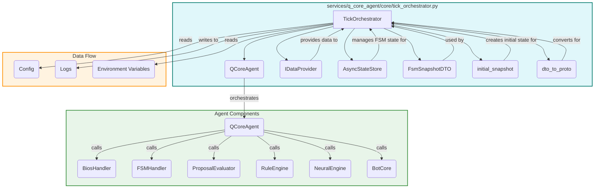

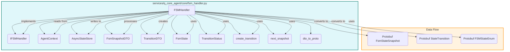

```mermaid
graph TD
    subgraph State_Types_Module [services/q_core_agent/state/types.py]
        A[FsmState]
        B[TransitionStatus]
        C[TransitionDTO]
        D[FsmSnapshotDTO]
        E[initial_snapshot()]
        F[create_transition()]
        G[next_snapshot()]
    end

    subgraph External_Libraries [External Libraries]
        H(dataclasses)
        I(enum)
        J(typing)
        K(time)
        L(uuid)
    end

    C -- uses --> A
    C -- uses --> B
    C -- uses --> K
    C -- uses --> L
    D -- uses --> A
    D -- uses --> C
    D -- uses --> K
    D -- uses --> L
    E -- creates --> D
    F -- creates --> C
    G -- creates --> D
    G -- uses --> C

    H -- provides decorators for --> C
    H -- provides decorators for --> D
    I -- provides base for --> A
    I -- provides base for --> B
    J -- provides type hints for --> C
    J -- provides type hints for --> D
    K -- provides time functions for --> C
    K -- provides time functions for --> D
    L -- provides UUID generation for --> C
    L -- provides UUID generation for --> D

    style State_Types_Module fill:#e0f7fa,stroke:#00796b,stroke-width:2px
    style External_Libraries fill:#e8f5e9,stroke:#388e3c,stroke-width:2px
```

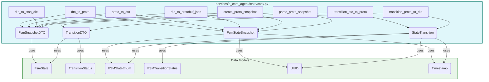

```mermaid
graph TD
    subgraph State_Store_Module [services/q_core_agent/state/store.py]
        A[AsyncStateStore] --> B(FsmSnapshotDTO)
        A --> C(initial_snapshot)
        A --> D(asyncio.Lock)
        A --> E(asyncio.Queue)
        A --> F(StateStoreError)
        A --> G(StateVersionError)
        H[create_store()] --> A
        I[create_initialized_store()] --> A
    end

    subgraph Data_Flow [Data Flow]
        J(Logs)
        K(Metrics)
        L(Health Status)
    end

    A -- manages --> B
    A -- uses --> C
    A -- uses --> D
    A -- publishes to --> E
    A -- raises --> F
    A -- raises --> G
    A -- writes to --> J
    A -- provides --> K
    A -- provides --> L

    style State_Store_Module fill:#e0f7fa,stroke:#00796b,stroke-width:2px
    style Data_Flow fill:#fff3e0,stroke:#ff8f00,stroke-width:2px
```

```mermaid
graph TD
    subgraph Test_Types_Module [services/q_core_agent/state/tests/test_types.py]
        A[TestFsmState] --> B(FsmState)
        C[TestTransitionDTO] --> D(TransitionDTO)
        C --> B
        E[TestFsmSnapshotDTO] --> F(FsmSnapshotDTO)
        E --> D
        E --> B
        G[TestInitialSnapshot] --> F
        H[TestNextSnapshot] --> F
        H --> D
        H --> B
        I[TestEdgeCases] --> F
        I --> D
        I --> B
    end

    subgraph Tested_Components [services/q_core_agent/state/types.py]
        J(FsmState)
        K(TransitionDTO)
        L(FsmSnapshotDTO)
        M(initial_snapshot)
        N(create_transition)
        O(next_snapshot)
    end

    subgraph External_Test_Framework [External Test Framework]
        P(pytest)
        Q(dataclasses.FrozenInstanceError)
        R(time)
        S(uuid)
    end

    A -- tests --> J
    C -- tests --> K
    C -- tests --> J
    E -- tests --> L
    E -- tests --> K
    E -- tests --> J
    G -- tests --> M
    H -- tests --> L
    H -- tests --> K
    H -- tests --> J
    I -- tests --> L
    I -- tests --> K
    I -- tests --> J

    P -- runs --> A
    P -- runs --> C
    P -- runs --> E
    P -- runs --> G
    P -- runs --> H
    P -- runs --> I

    Q -- raised by --> K
    Q -- raised by --> L
    R -- used by --> K
    R -- used by --> L
    S -- used by --> K
    S -- used by --> L

    style Test_Types_Module fill:#e0f7fa,stroke:#00796b,stroke-width:2px
    style Tested_Components fill:#e8f5e9,stroke:#388e3c,stroke-width:2px
    style External_Test_Framework fill:#fff3e0,stroke:#ff8f00,stroke-width:2px
```

```mermaid
graph TD
    subgraph Test_Conversion_Module [services/q_core_agent/state/tests/test_conv.py]
        A[TestEnumMappings] --> B(FSM_STATE_DTO_TO_PROTO)
        A --> C(FSM_STATE_PROTO_TO_DTO)
        A --> D(TRANSITION_STATUS_DTO_TO_PROTO)
        A --> E(TRANSITION_STATUS_PROTO_TO_DTO)
        F[TestTransitionConversion] --> G(transition_dto_to_proto)
        F --> H(transition_proto_to_dto)
        F --> I(create_transition)
        J[TestSnapshotConversion] --> K(dto_to_proto)
        J --> L(proto_to_dto)
        J --> I
        M[TestConversionErrors] --> K
        M --> L
        N[TestJSONConversion] --> O(dto_to_json_dict)
        N --> P(dto_to_protobuf_json)
        Q[TestHelperFunctions] --> R(create_proto_snapshot)
        Q --> S(parse_proto_snapshot)
        T[TestTimestampHandling] --> U(_float_to_timestamp)
        T --> V(_timestamp_to_float)
        W[TestEdgeCasesAndBoundaries] --> K
        W --> L
    end

    subgraph Tested_Components [services/q_core_agent/state/conv.py]
        X(dto_to_proto)
        Y(proto_to_dto)
        Z(transition_dto_to_proto)
        AA(transition_proto_to_dto)
        BB(dto_to_json_dict)
        CC(dto_to_protobuf_json)
        DD(create_proto_snapshot)
        EE(parse_proto_snapshot)
        FF(_float_to_timestamp)
        GG(_timestamp_to_float)
    end

    subgraph Data_Models [Data Models]
        HH(FsmState)
        II(TransitionStatus)
        JJ(FsmSnapshotDTO)
        KK(TransitionDTO)
        LL(FSMStateEnum)
        MM(FSMTransitionStatus)
        NN(UUID)
        OO(Timestamp)
    end

    subgraph External_Test_Framework [External Test Framework]
        PP(pytest)
        QQ(unittest.mock.Mock)
        RR(unittest.mock.patch)
    end

    F -- tests --> Z
    F -- tests --> AA
    J -- tests --> X
    J -- tests --> Y
    M -- tests --> X
    M -- tests --> Y
    N -- tests --> BB
    N -- tests --> CC
    Q -- tests --> DD
    Q -- tests --> EE
    T -- tests --> FF
    T -- tests --> GG
    W -- tests --> X
    W -- tests --> Y

    PP -- runs --> A
    PP -- runs --> F
    PP -- runs --> J
    PP -- runs --> M
    PP -- runs --> N
    PP -- runs --> Q
    PP -- runs --> T
    PP -- runs --> W

    QQ -- used by --> M
    RR -- used by --> M

    style Test_Conversion_Module fill:#e0f7fa,stroke:#00796b,stroke-width:2px
    style Tested_Components fill:#e8f5e9,stroke:#388e3c,stroke-width:2px
    style Data_Models fill:#fff3e0,stroke:#ff8f00,stroke-width:2px
    style External_Test_Framework fill:#c8e6c9,stroke:#4caf50,stroke-width:2px
```

```mermaid
graph TD
    subgraph Test_Store_Module [services/q_core_agent/state/tests/test_store.py]
        A[TestAsyncStateStoreBasics] --> B(AsyncStateStore)
        A --> C(FsmSnapshotDTO)
        A --> D(StateStoreError)
        A --> E(StateVersionError)
        F[TestAsyncStateStorePubSub] --> B
        F --> C
        F --> G(asyncio.Queue)
        H[TestAsyncStateStoreConcurrency] --> B
        H --> C
        H --> G
        I[TestAsyncStateStoreMetrics] --> B
        I --> C
        J[TestAsyncStateStoreHelpers] --> B
        J --> C
        K[TestAsyncStateStoreErrorHandling] --> B
        K --> C
        K --> G
    end

    subgraph Tested_Components [services/q_core_agent/state/store.py]
        L(AsyncStateStore)
        M(StateStoreError)
        N(StateVersionError)
        O(create_store)
        P(create_initialized_store)
    end

    subgraph Data_Models [Data Models]
        Q(FsmSnapshotDTO)
        R(FsmState)
    end

    subgraph External_Test_Framework [External Test Framework]
        S(pytest)
        T(asyncio)
        U(unittest.mock.Mock)
        V(unittest.mock.AsyncMock)
    end

    A -- tests --> L
    A -- tests --> Q
    A -- tests --> M
    A -- tests --> N
    F -- tests --> L
    F -- tests --> Q
    F -- tests --> G
    H -- tests --> L
    H -- tests --> Q
    H -- tests --> G
    I -- tests --> L
    I -- tests --> Q
    J -- tests --> L
    J -- tests --> Q
    K -- tests --> L
    K -- tests --> Q
    K -- tests --> G

    S -- runs --> A
    S -- runs --> F
    S -- runs --> H
    S -- runs --> I
    S -- runs --> J
    S -- runs --> K

    T -- used by --> A
    T -- used by --> F
    T -- used by --> H
    T -- used by --> I
    T -- used by --> J
    T -- used by --> K

    U -- used by --> F
    U -- used by --> K
    V -- used by --> K

    style Test_Store_Module fill:#e0f7fa,stroke:#00796b,stroke-width:2px
    style Tested_Components fill:#e8f5e9,stroke:#388e3c,stroke-width:2px
    style Data_Models fill:#fff3e0,stroke:#ff8f00,stroke-width:2px
    style External_Test_Framework fill:#c8e6c9,stroke:#4caf50,stroke-width:2px
```

```mermaid
graph TD
    subgraph Test_Integration_Module [services/q_core_agent/state/tests/test_integration.py]
        A[MockAgentContext]
        B[MockFSMHandler]
        C[TestFSMHandlerStateStoreIntegration] --> D(AsyncStateStore)
        C --> B
        C --> A
        E[TestStateStoreSubscriberIntegration] --> D
        E --> B
        E --> A
        F[TestConversionIntegration] --> D
        F --> B
        F --> A
        G[TestConcurrentIntegration] --> D
        G --> B
        G --> A
        H[TestErrorHandlingIntegration] --> D
        H --> B
        H --> A
        I[TestFeatureFlagIntegration] --> D
        I --> B
        I --> A
    end

    subgraph Tested_Components [Components under Integration Test]
        J(AsyncStateStore)
        K(FSMHandler)
        L(AgentContext)
        M(dto_to_proto)
        N(proto_to_dto)
        O(dto_to_json_dict)
    end

    subgraph Data_Models [Data Models]
        P(FsmSnapshotDTO)
        Q(FsmState)
        R(TransitionStatus)
    end

    subgraph External_Test_Framework [External Test Framework]
        S(pytest)
        T(asyncio)
        U(unittest.mock.Mock)
        V(unittest.mock.AsyncMock)
        W(unittest.mock.patch)
        X(unittest.mock.MagicMock)
        Y(os)
    end

    C -- tests integration of --> J
    C -- tests integration of --> K
    C -- uses --> P
    C -- uses --> Q
    C -- uses --> R

    E -- tests integration of --> J
    E -- tests integration of --> K
    E -- uses --> P
    E -- uses --> Q
    E -- uses --> R

    F -- tests integration of --> J
    F -- tests integration of --> K
    F -- uses --> P
    F -- uses --> Q
    F -- uses --> R
    F -- uses --> M
    F -- uses --> N
    F -- uses --> O

    G -- tests integration of --> J
    G -- tests integration of --> K
    G -- uses --> P
    G -- uses --> Q
    G -- uses --> R

    H -- tests integration of --> J
    H -- tests integration of --> K
    H -- uses --> P
    H -- uses --> Q
    H -- uses --> R

    I -- tests integration of --> J
    I -- tests integration of --> K
    I -- uses --> P
    I -- uses --> Q
    I -- uses --> R

    S -- runs --> C
    S -- runs --> E
    S -- runs --> F
    S -- runs --> G
    S -- runs --> H
    S -- runs --> I

    T -- used by --> C
    T -- used by --> E
    T -- used by --> F
    T -- used by --> G
    T -- used by --> H
    T -- used by --> I

    U -- used by --> A
    U -- used by --> B
    U -- used by --> H
    V -- used by --> H
    W -- used by --> I
    X -- used by --> A

    Y -- used by --> I

    style Test_Integration_Module fill:#e0f7fa,stroke:#00796b,stroke-width:2px
    style Tested_Components fill:#e8f5e9,stroke:#388e3c,stroke-width:2px
    style Data_Models fill:#fff3e0,stroke:#ff8f00,stroke-width:2px
    style External_Test_Framework fill:#c8e6c9,stroke:#4caf50,stroke-width:2px
```

```mermaid
graph TD
    subgraph Test_Stress_Module [services/q_core_agent/state/tests/test_stress.py]
        A[PerformanceMonitor]
        B[TestHighVolumeOperations] --> C(AsyncStateStore)
        B --> D(FsmSnapshotDTO)
        B --> E(FsmState)
        B --> F(next_snapshot)
        G[TestConcurrencyStress] --> C
        G --> D
        G --> E
        G --> F
        H[TestMemoryStress] --> C
        H --> D
        H --> E
        H --> F
        I[TestLongRunningStability] --> C
        I --> D
        I --> E
        I --> F
        J[TestErrorHandlingStress] --> C
        J --> D
        J --> E
        J --> F
        K[TestPerformanceBenchmarks] --> C
        K --> D
        K --> E
    end

    subgraph Tested_Components [services/q_core_agent/state/store.py]
        L(AsyncStateStore)
        M(StateStoreError)
        N(create_initialized_store)
    end

    subgraph Data_Models [Data Models]
        O(FsmSnapshotDTO)
        P(FsmState)
    end

    subgraph External_Test_Framework [External Test Framework]
        Q(pytest)
        R(asyncio)
        S(time)
        T(gc)
        U(psutil)
        V(random)
        W(unittest.mock.Mock)
    end

    B -- tests --> L
    B -- uses --> O
    B -- uses --> P
    B -- uses --> F
    G -- tests --> L
    G -- uses --> O
    G -- uses --> P
    G -- uses --> F
    H -- tests --> L
    H -- uses --> O
    H -- uses --> P
    H -- uses --> F
    I -- tests --> L
    I -- uses --> O
    I -- uses --> P
    I -- uses --> F
    J -- tests --> L
    J -- uses --> O
    J -- uses --> P
    J -- uses --> F
    K -- tests --> L
    K -- uses --> O
    K -- uses --> P

    Q -- runs --> B
    Q -- runs --> G
    Q -- runs --> H
    Q -- runs --> I
    Q -- runs --> J
    Q -- runs --> K

    R -- used by --> B
    R -- used by --> G
    R -- used by --> H
    R -- used by --> I
    R -- used by --> J
    R -- used by --> K

    S -- used by --> A
    S -- used by --> B
    S -- used by --> G
    S -- used by --> H
    S -- used by --> I
    S -- used by --> J
    S -- used by --> K

    T -- used by --> H
    U -- used by --> A
    V -- used by --> I
    W -- used by --> G

    style Test_Stress_Module fill:#e0f7fa,stroke:#00796b,stroke-width:2px
    style Tested_Components fill:#e8f5e9,stroke:#388e3c,stroke-width:2px
    style Data_Models fill:#fff3e0,stroke:#ff8f00,stroke-width:2px
    style External_Test_Framework fill:#c8e6c9,stroke:#4caf50,stroke-width:2px
```

```mermaid
graph TD
    subgraph Hot_Test_Script [scripts/hot_test_statestore.sh]
        A[main()] --> B(check_environment)
        A --> C(syntax_check)
        A --> D(import_check)
        A --> E(functional_test)
        A --> F(run_unit_tests)
        A --> G(run_integration_tests)
        A --> H(run_stress_tests)
        A --> I(performance_test)
        A --> J(memory_leak_test)
        A --> K(compatibility_test)
        A --> L(generate_report)
    end

    subgraph Tested_Components [StateStore Architecture]
        M(services/q_core_agent/state/types.py)
        N(services/q_core_agent/state/store.py)
        O(services/q_core_agent/state/conv.py)
        P(services/q_core_agent/state/tests/test_types.py)
        Q(services/q_core_agent/state/tests/test_store.py)
        R(services/q_core_agent/state/tests/test_conv.py)
        S(services/q_core_agent/state/tests/test_integration.py)
        T(services/q_core_agent/state/tests/test_stress.py)
    end

    subgraph External_Tools [External Tools]
        U(python3)
        V(pytest)
        W(psutil)
        X(asyncio)
        Y(gc)
    end

    B -- checks existence of --> M
    B -- checks existence of --> N
    B -- checks existence of --> O
    B -- checks dependencies --> U
    B -- checks dependencies --> V
    B -- checks dependencies --> W
    B -- checks dependencies --> X

    C -- compiles --> M
    C -- compiles --> N
    C -- compiles --> O

    D -- imports --> M
    D -- imports --> N
    D -- imports --> O

    E -- creates temp script --> M
    E -- creates temp script --> N
    E -- creates temp script --> O
    E -- runs --> U
    E -- runs --> V
    E -- runs --> X

    F -- runs --> U
    F -- runs --> V
    F -- runs --> P
    F -- runs --> Q
    F -- runs --> R

    G -- runs --> U
    G -- runs --> V
    G -- runs --> S

    H -- runs --> U
    H -- runs --> V
    H -- runs --> T

    I -- creates temp script --> M
    I -- creates temp script --> N
    I -- runs --> U
    I -- runs --> X

    J -- creates temp script --> M
    J -- creates temp script --> N
    J -- runs --> U
    J -- runs --> X
    J -- uses --> Y

    K -- runs --> U
    K -- uses --> M
    K -- uses --> N
    K -- uses --> O

    L -- generates --> Z(HOT_TEST_REPORT.md)

    style Hot_Test_Script fill:#e0f7fa,stroke:#00796b,stroke-width:2px
    style Tested_Components fill:#e8f5e9,stroke:#388e3c,stroke-width:2px
    style External_Tools fill:#fff3e0,stroke:#ff8f00,stroke-width:2px
```

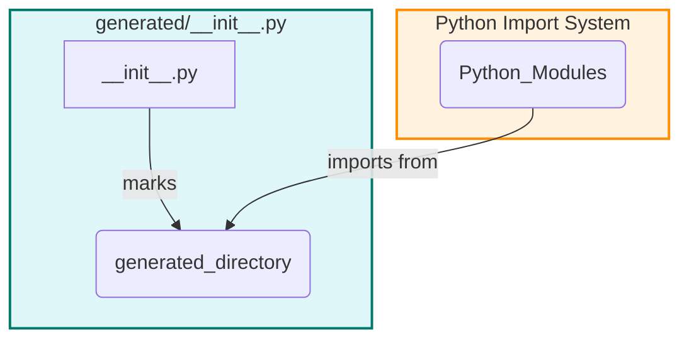

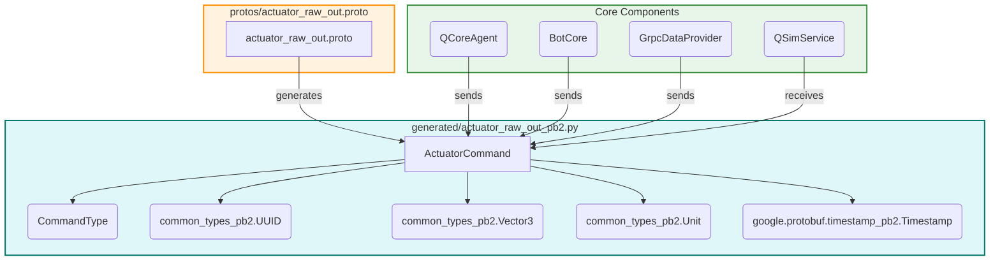

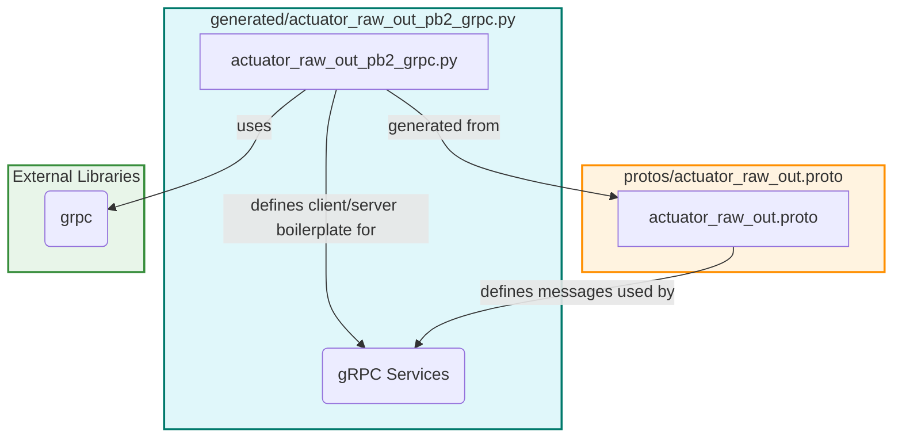

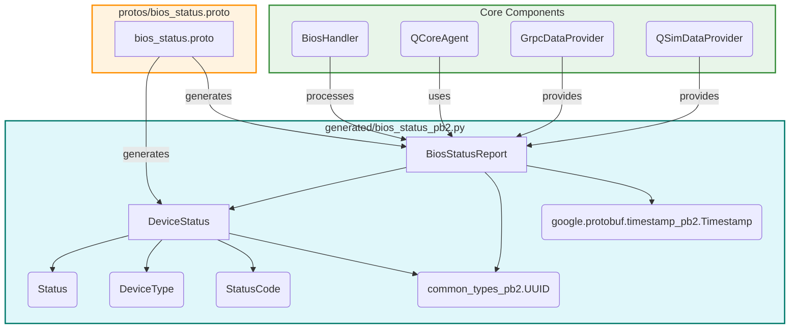

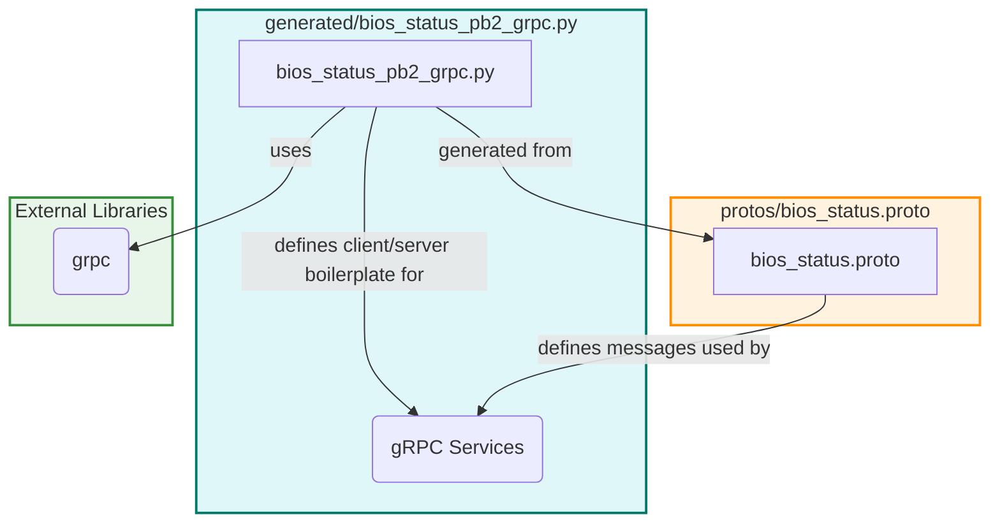

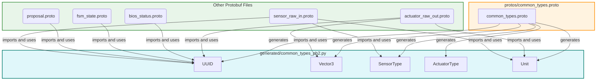

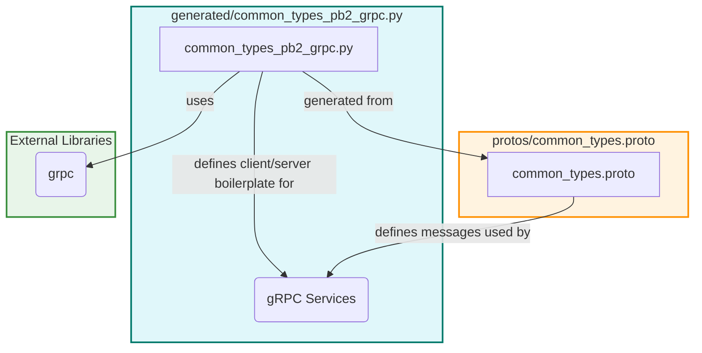

```mermaid
graph TD
    subgraph Generated_Protobuf_FSM [generated/fsm_state_pb2.py]
        A[FSMStateEnum]
        B[FSMTransitionStatus]
        C[StateTransition] --> A
        C --> B
        C --> D(google.protobuf.timestamp_pb2.Timestamp)
        E[FsmStateSnapshot] --> A
        E --> C
        E --> D
        E --> F(qiki.common.UUID)
    end

    subgraph Protobuf_Schema [protos/fsm_state.proto]
        G[fsm_state.proto]
    end

    subgraph Core_Components [Core Components]
        H(FSMHandler)
        I(StateStore)
        J(TickOrchestrator)
        K(conv.py)
    end

    G -- generates --> A
    G -- generates --> B
    G -- generates --> C
    G -- generates --> E

    H -- uses --> A
    H -- uses --> B
    H -- uses --> C
    H -- uses --> E
    I -- uses --> E
    J -- uses --> E
    K -- converts to/from --> E
    K -- converts to/from --> C

    style Generated_Protobuf_FSM fill:#e0f7fa,stroke:#00796b,stroke-width:2px
    style Protobuf_Schema fill:#fff3e0,stroke:#ff8f00,stroke-width:2px
    style Core_Components fill:#e8f5e9,stroke:#388e3c,stroke-width:2px
```

```mermaid
graph TD
    subgraph Generated_Protobuf_gRPC_FSM [generated/fsm_state_pb2_grpc.py]
        A[fsm_state_pb2_grpc.py] -- defines client/server boilerplate for --> B(gRPC Services)
    end

    subgraph Protobuf_Schema [protos/fsm_state.proto]
        C[fsm_state.proto] -- defines messages used by --> B
    end

    subgraph External_Libraries [External Libraries]
        D(grpc)
    end

    A -- uses --> D
    A -- generated from --> C

    style Generated_Protobuf_gRPC_FSM fill:#e0f7fa,stroke:#00796b,stroke-width:2px
    style Protobuf_Schema fill:#fff3e0,stroke:#ff8f00,stroke-width:2px
    style External_Libraries fill:#e8f5e9,stroke:#388e3c,stroke-width:2px
```

```mermaid
graph TD
    subgraph Generated_Protobuf_Proposal [generated/proposal_pb2.py]
        A[Proposal] --> B(ProposalType)
        A --> C(ProposalStatus)
        A --> D(common_types_pb2.UUID)
        A --> E(actuator_raw_out_pb2.ActuatorCommand)
        A --> F(google.protobuf.timestamp_pb2.Timestamp)
        A --> G(google.protobuf.duration_pb2.Duration)
    end

    subgraph Protobuf_Schema [protos/proposal.proto]
        H[proposal.proto]
    end

    subgraph Core_Components [Core Components]
        I(RuleEngine)
        J(NeuralEngine)
        K(ProposalEvaluator)
        L(QCoreAgent)
    end

    H -- generates --> A
    I -- generates --> A
    J -- generates --> A
    K -- evaluates --> A
    L -- uses --> A

    style Generated_Protobuf_Proposal fill:#e0f7fa,stroke:#00796b,stroke-width:2px
    style Protobuf_Schema fill:#fff3e0,stroke:#ff8f00,stroke-width:2px
    style Core_Components fill:#e8f5e9,stroke:#388e3c,stroke-width:2px
```

```mermaid
graph TD
    subgraph Generated_Protobuf_gRPC_Proposal [generated/proposal_pb2_grpc.py]
        A[proposal_pb2_grpc.py] -- defines client/server boilerplate for --> B(gRPC Services)
    end

    subgraph Protobuf_Schema [protos/proposal.proto]
        C[proposal.proto] -- defines messages used by --> B
    end

    subgraph External_Libraries [External Libraries]
        D(grpc)
    end

    A -- uses --> D
    A -- generated from --> C

    style Generated_Protobuf_gRPC_Proposal fill:#e0f7fa,stroke:#00796b,stroke-width:2px
    style Protobuf_Schema fill:#fff3e0,stroke:#ff8f00,stroke-width:2px
    style External_Libraries fill:#e8f5e9,stroke:#388e3c,stroke-width:2px
```

```mermaid
graph TD
    subgraph Generated_Protobuf_Sensor [generated/sensor_raw_in_pb2.py]
        A[SensorReading] --> B(common_types_pb2.UUID)
        A --> C(common_types_pb2.SensorType)
        A --> D(common_types_pb2.Vector3)
        A --> E(common_types_pb2.Unit)
        A --> F(google.protobuf.timestamp_pb2.Timestamp)
    end

    subgraph Protobuf_Schema [protos/sensor_raw_in.proto]
        G[sensor_raw_in.proto]
    end

    subgraph Core_Components [Core Components]
        H(QSimService)
        I(IDataProvider)
        J(QCoreAgent)
    end

    G -- generates --> A
    H -- generates --> A
    I -- provides --> A
    J -- consumes --> A

    style Generated_Protobuf_Sensor fill:#e0f7fa,stroke:#00796b,stroke-width:2px
    style Protobuf_Schema fill:#fff3e0,stroke:#ff8f00,stroke-width:2px
    style Core_Components fill:#e8f5e9,stroke:#388e3c,stroke-width:2px
```

```mermaid
graph TD
    subgraph Generated_Protobuf_gRPC_Sensor [generated/sensor_raw_in_pb2_grpc.py]
        A[sensor_raw_in_pb2_grpc.py] -- defines client/server boilerplate for --> B(gRPC Services)
    end

    subgraph Protobuf_Schema [protos/sensor_raw_in.proto]
        C[sensor_raw_in.proto] -- defines messages used by --> B
    end

    subgraph External_Libraries [External Libraries]
        D(grpc)
    end

    A -- uses --> D
    A -- generated from --> C

    style Generated_Protobuf_gRPC_Sensor fill:#e0f7fa,stroke:#00796b,stroke-width:2px
    style Protobuf_Schema fill:#fff3e0,stroke:#ff8f00,stroke-width:2px
    style External_Libraries fill:#e8f5e9,stroke:#388e3c,stroke-width:2px
```

```mermaid
graph TD
    subgraph Protobuf_Source_Actuator [protos/actuator_raw_out.proto]
        A[ActuatorCommand] --> B(CommandType)
        A --> C(qiki.common.UUID)
        A --> D(qiki.common.Vector3)
        A --> E(qiki.common.Unit)
        A --> F(google.protobuf.Timestamp)
    end

    subgraph Generated_Code [Generated Code]
        G(generated/actuator_raw_out_pb2.py)
        H(generated/actuator_raw_out_pb2_grpc.py)
    end

    subgraph Imported_Schemas [Imported Schemas]
        I(common_types.proto)
        J(google/protobuf/timestamp.proto)
    end

    A -- generates --> G
    A -- generates --> H
    A -- imports --> I
    A -- imports --> J

    style Protobuf_Source_Actuator fill:#e0f7fa,stroke:#00796b,stroke-width:2px
    style Generated_Code fill:#e8f5e9,stroke:#388e3c,stroke-width:2px
    style Imported_Schemas fill:#fff3e0,stroke:#ff8f00,stroke-width:2px
```

```mermaid
graph TD
    subgraph Protobuf_Source_BIOS [protos/bios_status.proto]
        A[DeviceStatus] --> B(Status)
        A --> C(DeviceType)
        A --> D(StatusCode)
        A --> E(qiki.common.UUID)
        F[BiosStatusReport] --> A
        F --> E
        F --> G(google.protobuf.timestamp_pb2.Timestamp)
    end

    subgraph Generated_Code [Generated Code]
        H(generated/bios_status_pb2.py)
        I(generated/bios_status_pb2_grpc.py)
    end

    subgraph Imported_Schemas [Imported Schemas]
        J(common_types.proto)
        K(google/protobuf/timestamp.proto)
    end

    A -- generates --> H
    A -- generates --> I
    F -- generates --> H
    F -- generates --> I
    A -- imports --> J
    A -- imports --> K
    F -- imports --> J
    F -- imports --> K

    style Protobuf_Source_BIOS fill:#e0f7fa,stroke:#00796b,stroke-width:2px
    style Generated_Code fill:#e8f5e9,stroke:#388e3c,stroke-width:2px
    style Imported_Schemas fill:#fff3e0,stroke:#ff8f00,stroke-width:2px
```

```mermaid
graph TD
    subgraph Protobuf_Source_Common [protos/common_types.proto]
        A[UUID]
        B[Vector3]
        C[SensorType]
        D[ActuatorType]
        E[Unit]
    end

    subgraph Generated_Code [Generated Code]
        F(generated/common_types_pb2.py)
        G(generated/common_types_pb2_grpc.py)
    end

    subgraph Other_Schemas_Importing [Other .proto Schemas Importing This]
        H(actuator_raw_out.proto)
        I(bios_status.proto)
        J(fsm_state.proto)
        K(proposal.proto)
        L(sensor_raw_in.proto)
    end

    A -- generates --> F
    A -- generates --> G
    B -- generates --> F
    B -- generates --> G
    C -- generates --> F
    C -- generates --> G
    D -- generates --> F
    D -- generates --> G
    E -- generates --> F
    E -- generates --> G

    H -- imports --> A
    H -- imports --> B
    H -- imports --> E
    I -- imports --> A
    J -- imports --> A
    K -- imports --> A
    L -- imports --> A
    L -- imports --> C
    L -- imports --> E

    style Protobuf_Source_Common fill:#e0f7fa,stroke:#00796b,stroke-width:2px
    style Generated_Code fill:#e8f5e9,stroke:#388e3c,stroke-width:2px
    style Other_Schemas_Importing fill:#fff3e0,stroke:#ff8f00,stroke-width:2px
```

```mermaid
graph TD
    subgraph Protobuf_Source_FSM [protos/fsm_state.proto]
        A[FSMStateEnum]
        B[FSMTransitionStatus]
        C[StateTransition] --> A
        C --> B
        C --> D(google.protobuf.Timestamp)
        E[FsmStateSnapshot] --> A
        E --> C
        E --> D
        E --> F(qiki.common.UUID)
    end

    subgraph Generated_Code [Generated Code]
        G(generated/fsm_state_pb2.py)
        H(generated/fsm_state_pb2_grpc.py)
    end

    subgraph Imported_Schemas [Imported Schemas]
        I(common_types.proto)
        J(google/protobuf/timestamp.proto)
    end

    A -- generates --> G
    A -- generates --> H
    B -- generates --> G
    B -- generates --> H
    C -- generates --> G
    C -- generates --> H
    E -- generates --> G
    E -- generates --> H

    C -- imports --> I
    C -- imports --> J
    E -- imports --> I
    E -- imports --> J

    style Protobuf_Source_FSM fill:#e0f7fa,stroke:#00796b,stroke-width:2px
    style Generated_Code fill:#e8f5e9,stroke:#388e3c,stroke-width:2px
    style Imported_Schemas fill:#fff3e0,stroke:#ff8f00,stroke-width:2px
```

```mermaid
graph TD
    subgraph Protobuf_Source_Proposal [protos/proposal.proto]
        A[Proposal] --> B(ProposalType)
        A --> C(ProposalStatus)
        A --> D(qiki.common.UUID)
        A --> E(qiki.actuators.ActuatorCommand)
        A --> F(google.protobuf.Timestamp)
        A --> G(google.protobuf.Duration)
    end

    subgraph Generated_Code [Generated Code]
        H(generated/proposal_pb2.py)
        I(generated/proposal_pb2_grpc.py)
    end

    subgraph Imported_Schemas [Imported Schemas]
        J(common_types.proto)
        K(actuator_raw_out.proto)
        L(google/protobuf/timestamp.proto)
        M(google/protobuf/duration.proto)
    end

    A -- generates --> H
    A -- generates --> I
    A -- imports --> J
    A -- imports --> K
    A -- imports --> L
    A -- imports --> M

    style Protobuf_Source_Proposal fill:#e0f7fa,stroke:#00796b,stroke-width:2px
    style Generated_Code fill:#e8f5e9,stroke:#388e3c,stroke-width:2px
    style Imported_Schemas fill:#fff3e0,stroke:#ff8f00,stroke-width:2px
```

```mermaid
graph TD
    subgraph Protobuf_Source_Sensor [protos/sensor_raw_in.proto]
        A[SensorReading] --> B(qiki.common.UUID)
        A --> C(qiki.common.SensorType)
        A --> D(qiki.common.Vector3)
        A --> E(qiki.common.Unit)
        A --> F(google.protobuf.timestamp_pb2.Timestamp)
    end

    subgraph Generated_Code [Generated Code]
        G(generated/sensor_raw_in_pb2.py)
        H(generated/sensor_raw_in_pb2_grpc.py)
    end

    subgraph Imported_Schemas [Imported Schemas]
        I(common_types.proto)
        J(google/protobuf/timestamp.proto)
    end

    A -- generates --> G
    A -- generates --> H
    A -- imports --> I
    A -- imports --> J

    style Protobuf_Source_Sensor fill:#e0f7fa,stroke:#00796b,stroke-width:2px
    style Generated_Code fill:#e8f5e9,stroke:#388e3c,stroke-width:2px
    style Imported_Schemas fill:#fff3e0,stroke:#ff8f00,stroke-width:2px
```

```mermaid
graph TD
    subgraph Protobuf_Source_QSimAPI [protos/q_sim_api.proto]
        A[service QSimAPI]
        B[rpc GetSensorData] --> C(google.protobuf.Empty)
        B --> D(qiki.sensors.SensorReading)
        E[rpc SendActuatorCommand] --> F(qiki.actuators.ActuatorCommand)
        E --> C
        G[rpc HealthCheck] --> C
        G --> H(HealthResponse)
        I[message HealthResponse]
    end

    subgraph Generated_Code [Generated Code]
        J(generated/q_sim_api_pb2.py)
        K(generated/q_sim_api_pb2_grpc.py)
    end

    subgraph Imported_Schemas [Imported Schemas]
        L(sensor_raw_in.proto)
        M(actuator_raw_out.proto)
        N(google/protobuf/empty.proto)
    end

    A -- defines --> B
    A -- defines --> E
    A -- defines --> G
    A -- generates --> J
    A -- generates --> K

    B -- uses --> L
    E -- uses --> M
    G -- uses --> I

    style Protobuf_Source_QSimAPI fill:#e0f7fa,stroke:#00796b,stroke-width:2px
    style Generated_Code fill:#e8f5e9,stroke:#388e3c,stroke-width:2px
    style Imported_Schemas fill:#fff3e0,stroke:#ff8f00,stroke-width:2px
```

```mermaid
graph TD
    subgraph QSimService_Module [services/q_sim_service/main.py]
        A[QSimService] --> B(WorldModel)
        A --> C(SensorReading)
        A --> D(ActuatorCommand)
        A --> E(UUID)
        A --> F(Timestamp)
        A --> G(MessageToDict)
        H[load_config()]
    end

    subgraph External_Interactions [External Interactions]
        I(QCoreAgent)
        J(config.yaml)
        K(logging.yaml)
    end

    A -- uses --> B
    A -- generates --> C
    A -- receives --> D
    A -- uses --> E
    A -- uses --> F
    A -- uses for logging --> G
    H -- reads --> J
    H -- provides config to --> A
    I -- sends commands to --> A
    I -- receives data from --> A
    K -- configures --> A

    style QSimService_Module fill:#e0f7fa,stroke:#00796b,stroke-width:2px
    style External_Interactions fill:#fff3e0,stroke:#ff8f00,stroke-width:2px
```

```mermaid
graph TD
    subgraph WorldModel_Module [services/q_sim_service/core/world_model.py]
        A[WorldModel] --> B(position: Vector3)
        A --> C(heading: float)
        A --> D(battery_level: float)
        A --> E(speed: float)
        A --> F(ActuatorCommand)
        A --> G(Vector3)
        A --> H(Unit)
    end

    subgraph External_Interactions [External Interactions]
        I(QSimService)
        J(agent_logger)
    end

    A -- initialized by --> I
    A -- updated by --> I
    A -- provides state to --> I
    A -- uses --> J
    I -- sends commands to --> A
    I -- requests state from --> A

    style WorldModel_Module fill:#e0f7fa,stroke:#00796b,stroke-width:2px
    style External_Interactions fill:#fff3e0,stroke:#ff8f00,stroke-width:2px
```

```mermaid
graph TD
    subgraph QSimService_Config [services/q_sim_service/config.yaml]
        A[sim_tick_interval]
        B[sim_sensor_type]
        C[log_level]
    end

    subgraph Consuming_Components [Consuming Components]
        D(QSimService)
    end

    A -- configures --> D
    B -- configures --> D
    C -- configures --> D

    style QSimService_Config fill:#e0f7fa,stroke:#00796b,stroke-width:2px
    style Consuming_Components fill:#e8f5e9,stroke:#388e3c,stroke-width:2px
```
