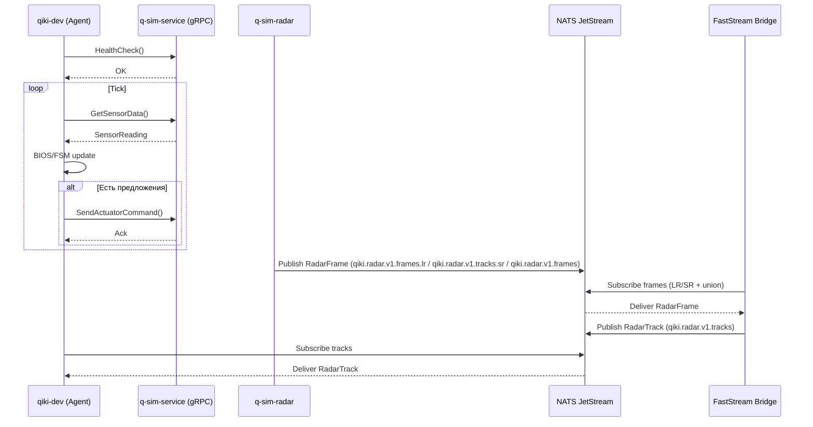

# Архитектура QIKI_DTMP (Phase 1)

Документ описывает актуальную архитектуру Phase 1 (сентябрь 2025): состав контейнеров, порядок запуска, потоки данных (включая Radar v1) и health‑механики.

## Контейнеры и роли
- **qiki-nats-phase1** — брокер сообщений NATS + JetStream (Порты: 4222, 8222). Хранит поток `QIKI_RADAR_V1`.
- **q-sim-service** — gRPC сервис симуляции (порт 50051). RPC: `HealthCheck`, `GetSensorData`, `SendActuatorCommand`, `GetRadarFrame`.
- **q-sim-radar** — генератор радарных кадров; публикует `RadarFrame` в `qiki.radar.v1.frames.lr`, `qiki.radar.v1.tracks.sr` и совместимый `qiki.radar.v1.frames`.
- **faststream-bridge** — FastStream приложение. Подписки: `qiki.radar.v1.frames.lr`, `qiki.radar.v1.tracks.sr`, `qiki.radar.v1.frames`, `qiki.commands.control`. Публикации: `qiki.radar.v1.tracks`, `qiki.responses.control`.
- **qiki-dev** — Q-Core Agent (`python -m qiki.services.q_core_agent.main --grpc`). Потребляет gRPC/NATS потоки.
- **nats-js-init** (one-shot) — утилита инициализации JetStream: создаёт stream `QIKI_RADAR_V1`, durable-консьюмеры `radar_frames_pull` / `radar_tracks_pull`.

## Порядок запуска и readiness
- NATS стартует первым; health-check: `GET /healthz` на `http://localhost:8222/healthz`.
- `nats-js-init` выполняется после здоровья NATS → создаёт JetStream stream/consumers.
- `q-sim-service` стартует после NATS; health-check через gRPC `HealthCheck`.
- `q-sim-radar` подключается к NATS и публикует кадры (логирует `Connected to NATS…`).
- `faststream-bridge` подписывается на NATS (кадры/команды) и публикует ответы/треки.
- `qiki-dev` стартует последним (ожидает health `q-sim-service`).

## Пошаговая схема тика (legacy)
1) Обновление контекста агента
   - BIOS: генерируется `BiosStatus` (все устройства OK).
   - FSM: минимальный валидный `FsmStateSnapshot` (BOOTING/OFFLINE).
   - Proposals: пусто (на текущем этапе).
2) Обработка BIOS: `BiosHandler.process_bios_status()` — валидирует профиль устройств, логирует «all systems go».
3) Обработка FSM (legacy):
   - `FSMHandler.process_fsm_state()` — если BIOS OK и текущее состояние BOOTING, переход в IDLE (фиксация `last_transition`, `history`).
   - При включённом StateStore — асинхронная ветка `process_fsm_dto()` с DTO и AsyncStateStore.
4) Генерация и оценка предложений
   - `RuleEngine` и `NeuralEngine` (заглушки) → 0 предложений.
   - `ProposalEvaluator` фильтрует/сортирует (сейчас пусто).
5) Действия (если есть принятые предложения)
   - Формируются `ActuatorCommand` (Pydantic) и отправляются через gRPC `SendActuatorCommand` (конвертеры Pydantic↔Protobuf в `shared/converters`).
6) Телеметрия и задержка
   - Получение SensorData через gRPC `GetSensorData()` (UUID, тип, timestamp, scalar/vector oneof), логирование, `sleep(tick_interval)`.

## Диаграмма последовательностей

## Radar v1 — поток данных

1. `q-sim-radar` генерирует `RadarFrameModel` (Pydantic) → конвертирует в proto → отправляет JSON-пэйлоад в `qiki.radar.v1.frames.lr` (кадры без ID/IFF), `qiki.radar.v1.tracks.sr` (SR-объекты с транспондером) и совместимый `qiki.radar.v1.frames`; заголовки включают `Nats-Msg-Id` и `x-range-band`.
2. JetStream (`QIKI_RADAR_V1`) сохраняет сообщения с deduplication окном 120 с; durable `radar_frames_pull` гарантирует чтение FastStream Bridge.
3. FastStream Bridge (`handle_radar_frame`) валидирует кадр, формирует минимальный `RadarTrackModel`, учитывая `range_band`, и публикует в `qiki.radar.v1.tracks`.
4. `radar_tracks_pull` потребитель доступен для подписчиков; `qiki-dev` и другие сервисы могут слушать тему и принимать решения с использованием `x-range-band`.
5. gRPC `GetRadarFrame` остаётся синхронной точкой доступа для fallback или отладки (возвращает последний сгенерированный кадр).

## Health/Recovery и наблюдаемость
- docker-compose healthchecks: `q-sim-service` (gRPC HealthCheck), `qiki-dev` (waits for dependency), `nats` (`/healthz`).
- `q-sim-radar` логирует подключение к NATS; при ошибке публикации выводит предупреждения.
- В логах FastStream Bridge фиксируются принятые кадры (frame_id, detections).
- Агент: при исключении в фазе тика — SAFE MODE, пауза `recovery_delay`, повтор.
- Логи: структурированы по фазам тика; рекомендуется унифицировать JSON‑формат и пробрасывать `correlation_id`.

## Параметры конфигурации (Pydantic v2)
- QCoreAgentConfig: `tick_interval`, `recovery_delay`, `grpc_server_address`, пороги и флаги.
- QSimServiceConfig: `sim_tick_interval`, `sim_sensor_type`, `log_level`, `radar.sr_threshold_m` (порог разделения LR/SR, метры).
- Рекомендуется перейти на Pydantic Settings для override через ENV.

## Рекомендации (стабильность и DX)
- gRPC клиент: задать таймауты и политику retry через `grpc.service_config` и keepalive/backoff опции канала.
- nats.py: включить auto reconnect (бесконечные попытки), callbacks on disconnect/reconnect, настроить JetStream (stream/consumer) при необходимости.
- FastStream: обработка исключений в хендлере, ограничение concurrency, backpressure.
- WorldModel: экспортирует Prometheus-метрики (`qiki_agent_radar_active_tracks`,
  `qiki_agent_guard_critical_active`, `qiki_agent_guard_warning_total`),
  дедуплицирует guard-ивенты и передаёт RuleEngine триггеры SAFE_MODE.

### Radar v1 (контракты)
- Protobuf: `protos/radar/v1/radar.proto` (сообщения: `RadarDetection`, `RadarFrame`, `RadarTrack`).
- Версионирование: `schema_version` в сообщениях; темы NATS `qiki.radar.v1.frames`, `qiki.radar.v1.tracks`.
- Генерация Python stubs: `tools/gen_protos.sh` (использует `grpcio-tools`, вывод в `generated/`).
- CI: ruff (E,F,TID252) с line-length=120, mypy, pytest с coverage.
