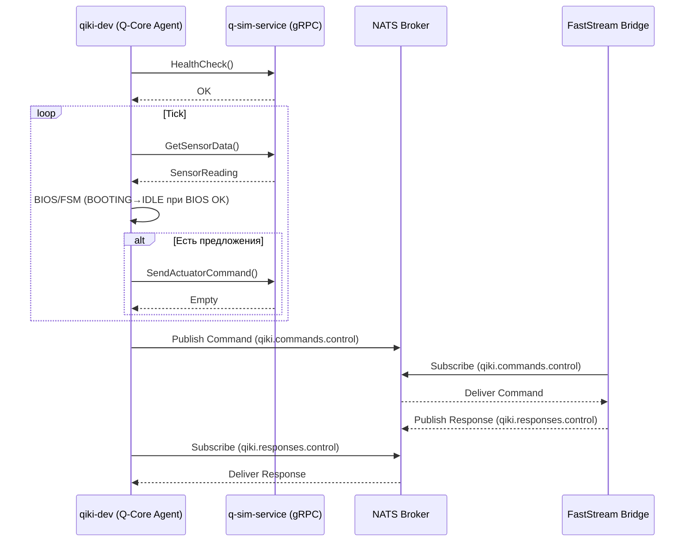

# Архитектура QIKI_DTMP (Phase 1)

Этот документ описывает текущую архитектуру из 4 контейнеров, порядок запуска и пошаговую схему работы бота (тик цикла), а также ключевые взаимодействия (gRPC, NATS/FastStream) и health‑механики.

## Контейнеры и роли
- nats: брокер сообщений (JetStream), порты: 4222 (клиент), 8222 (HTTP health).
- q-sim-service: gRPC сервис симуляции (порт 50051). Эндпоинты: HealthCheck, GetSensorData, SendActuatorCommand.
- faststream-bridge: мост между NATS и доменной логикой (подписка `qiki.commands.control`, публикация `qiki.responses.control`).
- qiki-dev: агент (Q-Core Agent), запускает `services/q_core_agent/main.py --grpc`.

## Порядок запуска и readiness
- nats стартует первым; health: `GET /healthz` на 8222.
- q-sim-service стартует вторым; health: gRPC HealthCheck (канальный вызов).
- faststream-bridge стартует параллельно после nats; подписка на NATS subject’ы.
- qiki-dev стартует после того, как q-sim-service стал healthy (depends_on + healthcheck).

## Пошаговая схема тика (legacy)
1) Обновление контекста агента
   - BIOS: генерируется `BiosStatus` (все устройства OK).
   - FSM: минимальный валидный `FsmStateSnapshot` (BOOTING/OFFLINE).
   - Proposals: пусто (на текущем этапе).
2) Обработка BIOS: `BiosHandler.process_bios_status()` — валидирует профиль устройств, логирует «all systems go».
3) Обработка FSM (legacy):
   - `FSMHandler.process_fsm_state()` — если BIOS OK и текущее состояние BOOTING, переход в IDLE (фиксация `last_transition`, `history`).
   - При включённом StateStore — асинхронная ветка `process_fsm_dto()` с DTO и AsyncStateStore.
4) Генерация и оценка предложений
   - `RuleEngine` и `NeuralEngine` (заглушки) → 0 предложений.
   - `ProposalEvaluator` фильтрует/сортирует (сейчас пусто).
5) Действия (если есть принятые предложения)
   - Формируются `ActuatorCommand` (Pydantic) и отправляются через gRPC `SendActuatorCommand` (конвертеры Pydantic↔Protobuf в `shared/converters`).
6) Телеметрия и задержка
   - Получение SensorData через gRPC `GetSensorData()` (UUID, тип, timestamp, scalar/vector oneof), логирование, `sleep(tick_interval)`.

## Диаграмма последовательностей

## Health/Recovery и наблюдаемость
- docker compose: `q-sim-service` имеет healthcheck (gRPC HealthCheck), `qiki-dev` ждёт readiness.
- Агент: при исключении в фазе тика — SAFE MODE, пауза `recovery_delay`, повтор.
- Логи: структурированы по фазам тика; рекомендуется унифицировать JSON‑формат и пробрасывать `correlation_id`.

## Параметры конфигурации (Pydantic v2)
- QCoreAgentConfig: `tick_interval`, `recovery_delay`, `grpc_server_address`, пороги и флаги.
- QSimServiceConfig: `sim_tick_interval`, `sim_sensor_type`, `log_level`.
- Рекомендуется перейти на Pydantic Settings для override через ENV.

## Рекомендации (стабильность и DX)
- gRPC клиент: задать таймауты и политику retry через `grpc.service_config` и keepalive/backoff опции канала.
- nats.py: включить auto reconnect (бесконечные попытки), callbacks on disconnect/reconnect, настроить JetStream (stream/consumer) при необходимости.
- FastStream: обработка исключений в хендлере, ограничение concurrency, backpressure.
- CI: ruff (E,F,TID252) с line-length=120, mypy, pytest с coverage.

