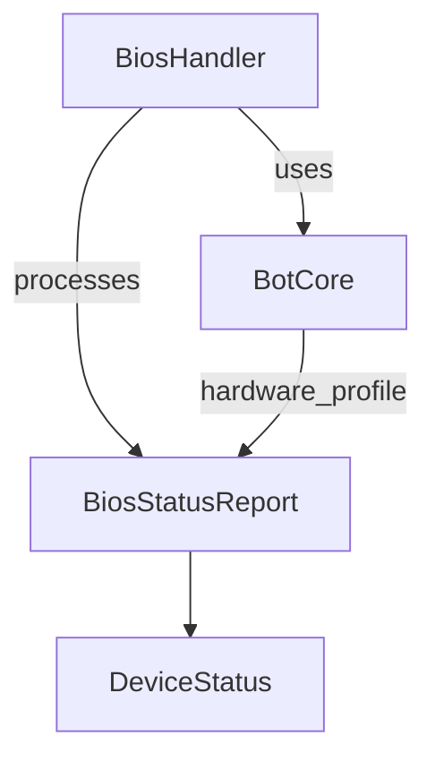

# Анализ файла: services/q_core_agent/core/bios_handler.py

## 1. Назначение и роль в проекте
`BiosHandler` обрабатывает отчёты BIOS (`BiosStatusReport`), проверяя соответствие фактических устройств ожидаемому профилю и формируя обновлённый статус системы.

## 2. Ключевые классы и методы
- `class BiosHandler(IBiosHandler)`:
  - `__init__(self, bot_core: BotCore)`: сохраняет ссылку на `BotCore` и логирует инициализацию.
  - `process_bios_status(self, bios_status: BiosStatusReport) -> BiosStatusReport`: анализирует устройства, добавляет отсутствующие и выставляет `all_systems_go`.

## 3. Зависимости и взаимодействия
- Использует `BotCore` для получения `hardware_profile`.
- Протобуф-классы `BiosStatusReport`, `DeviceStatus`, `UUID`.
- Логирование через `agent_logger.logger`.

## 4. Потенциальные проблемы и риски
- Отсутствие профиля переводит систему в «minimal» без строгой проверки.
- Метод синхронный и может тормозить при большом числе устройств.

## 5. Предлагаемые улучшения/рефакторинг
- Вынести проверку устройств в отдельные приватные методы для читаемости.
- Добавить обработку исключений при работе с профилем и более детальные коды ошибок.
- Рассмотреть возможность асинхронной обработки.

## 6. Тестируемость и стратегия тестирования
- Мокировать `BotCore` и подавать различные `BiosStatusReport`:
  - Полное совпадение устройств.
  - Пропущенные устройства.
  - Устройства с ошибочным статусом.
- Проверять корректность `all_systems_go` и добавления `DeviceStatus`.

## 7. Визуальная карта взаимодействия

