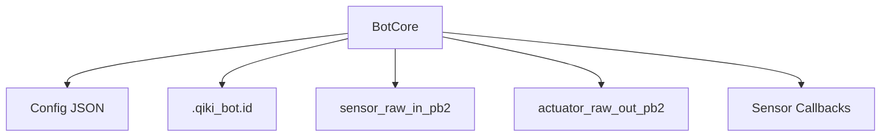

# Анализ файла: services/q_core_agent/core/bot_core.py

## 1. Назначение и роль в проекте
`BotCore` инкапсулирует идентификацию робота, загрузку конфигурации и взаимодействие с низкоуровневыми сенсорами и актуаторами. Это фундаментальный слой, на котором строятся остальные компоненты агента.

## 2. Ключевые методы и свойства
- Константы `BOT_ID_FILE`, `CONFIG_FILE` определяют расположение идентификатора и конфигурации.
- `__init__(self, base_path: str)`: загружает конфигурацию, инициализирует ID и внутренние структуры данных.
- `_load_config()`: читает JSON-конфиг, поддерживает режим `minimal`.
- `_initialize_bot_id()` / `_generate_bot_id()`: создают или читают уникальный идентификатор.
- Методы доступа: `get_id`, `get_property`.
- Работа с сенсорами/актуаторами: `_process_incoming_sensor_data`, `register_sensor_callback`, `get_latest_sensor_value`, `get_sensor_history`, `send_actuator_command`.
- Свойства: `current_sensor_snapshot`, `last_actuator_commands`.

## 3. Зависимости и взаимодействия
- Протобуф-модули `sensor_raw_in_pb2` и `actuator_raw_out_pb2`.
- Файловая система для хранения ID и конфигурации.
- Предоставляет интерфейс для других модулей (например, `BiosHandler`).

## 4. Потенциальные проблемы и риски
- Синхронные операции с файловой системой могут блокировать поток.
- Отсутствует валидация структуры `hardware_profile` при отправке команд.
- История сенсоров не реализована, хранится только последнее значение.
- Использование `print` в режиме minimal вместо логирования.

## 5. Предлагаемые улучшения/рефакторинг
- Добавить асинхронный или неблокирующий ввод-вывод.
- Вынести генерацию ID и загрузку конфигурации в отдельные сервисы.
- Реализовать буфер истории сенсоров и систему событий.
- Заменить `print` на `logger` для единообразного логирования.

## 6. Тестируемость и стратегия тестирования
- Юнит-тесты для генерации ID и загрузки конфигурации с использованием временных каталогов.
- Мокирование файловой системы для сценариев отсутствия конфигурации.
- Тесты на обработку команд и обновление снимков сенсоров.
- Интеграционные тесты совместно с `BiosHandler` и другими модулями.

## 7. Визуальная карта взаимодействия

