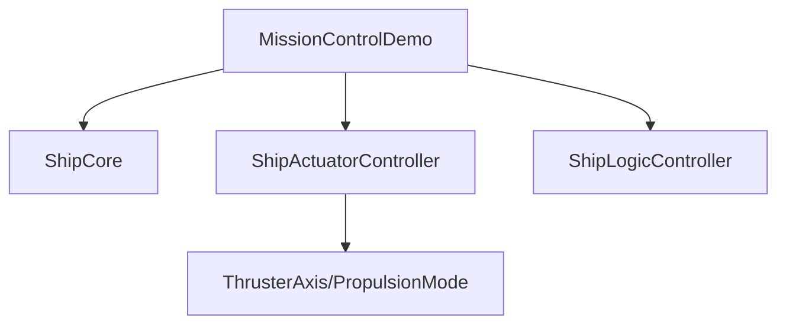

# Анализ файла: services/q_core_agent/core/mission_control_demo.py

## 1. Назначение и роль в проекте
Скрипт демонстрирует текстовый интерфейс оператора миссии, позволяя управлять космическим кораблём через `ShipCore` и сопутствующие контроллеры. Служит учебным и демонстрационным примером.

## 2. Ключевые классы и функции
- `class MissionControlDemo`:
  - `__init__`: инициализирует `ShipCore`, `ShipActuatorController`, `ShipLogicController`, фиксирует старт миссии.
  - `get_mission_time`, `get_telemetry`, `format_bar`, `get_alert_level`: вспомогательные методы для отображения статуса.
  - `render_interface`: выводит полное текстовое окно с телеметрией и журналом событий.
  - `simulate_mission_scenario`: прогоняет предопределённый набор команд.
  - `execute_demo_command`: разбирает и выполняет команды управления.
  - `interactive_demo`: предоставляет REPL для ручного ввода.
- `main()`: точка входа, предлагающая выбор режима демонстрации.

## 3. Зависимости и взаимодействия
- Внутренние модули: `ShipCore`, `ShipActuatorController`, `ShipLogicController`, `ThrusterAxis`, `PropulsionMode`.
- Стандартные библиотеки: `os`, `sys`, `time`, `datetime`.
- Взаимодействует с терминалом (очистка экрана, ввод команд).

## 4. Потенциальные проблемы и риски
- Использование `os.system('clear')` может быть несовместимо с некоторыми средами.
- Минимальная обработка ошибок; некорректный ввод может прервать сценарий.
- Сильная зависимость от тестовых классов затрудняет переносимость.

## 5. Предлагаемые улучшения/рефакторинг
- Вынести UI-логику в отдельный слой для облегчения тестирования.
- Добавить логирование вместо прямых `print`.
- Реализовать unit-тесты для `execute_demo_command` и `get_alert_level`.
- Предусмотреть режим без очистки экрана для записи логов.

## 6. Тестируемость и стратегия тестирования
- Использовать мок ввода `stdin` для проверки `interactive_demo`.
- Проверять корректность форматирования прогресс-баров и расчётов телеметрии.
- Автоматически запускать `simulate_mission_scenario` в CI с ограничением времени.

## 7. Визуальная карта взаимодействия

